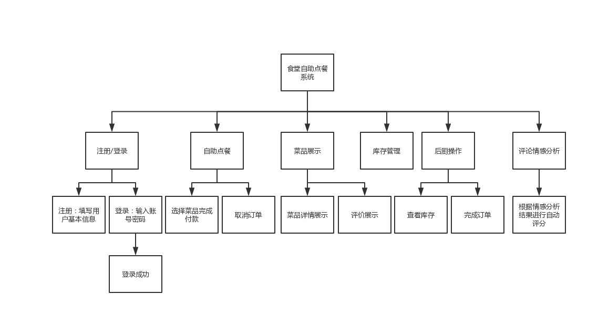

# FoodOrder
大三小学期大作业 食堂自助点餐系统

## 采用增量模型

书写时请注意代码格式，勤写注释啊~

## 老师的要求
### 第一周：任务分配，需求分析 完成需求分析
### 第二周：概要设计，数据库设计，初步完成详细设计 完成概要设计
### 第三周：完成详细设计      完成详细设计
### 第四周：完成编码 完成编码写完文档

## 项目进度计划
### 第一次迭代：
确定需求 2019/6/24——2019/6/25

需求归档 2019/6/26——2019/6/27

### 第二次迭代：
概要设计，数据库设计 2019/6/28——2019/6/30

建立程序整体的框架 2019/7/1——2019/7/2
	    
### 第三次迭代:
开始详细设计2019/7/3——2019/7/7

编码开始 2019/7/7——2019/7/16